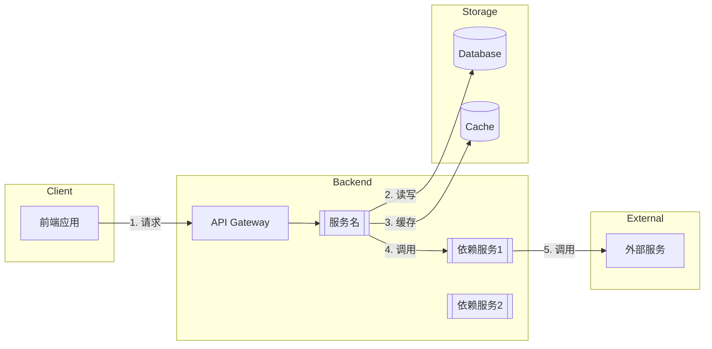
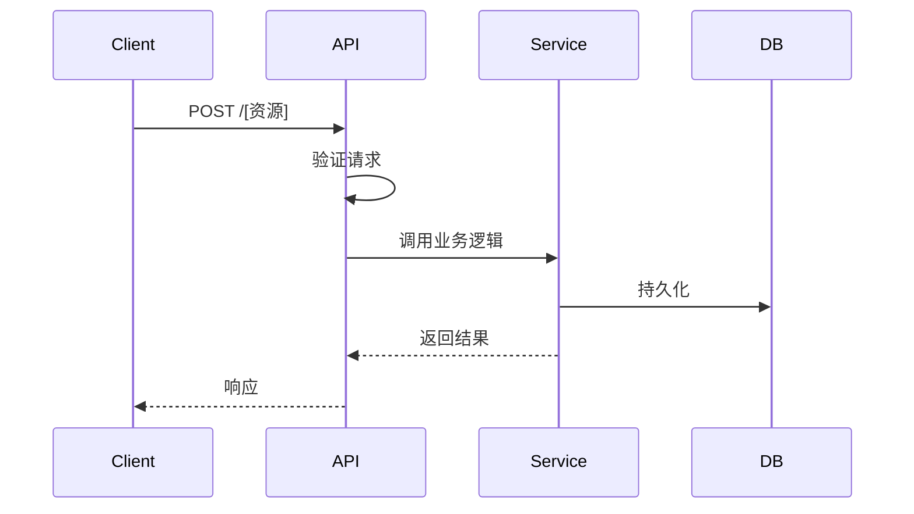
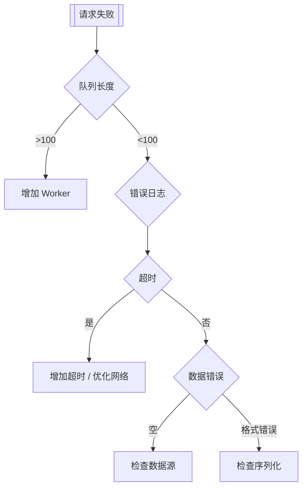

# Technical Writer — 技术文档专家

## 角色交接定义

### 从 Architect 接收

| 输入 | 格式 | 说明 |
|------|------|------|
| 架构决策记录 (ADR) | Markdown/ADRs/*.md | 关键架构决策及理由 |
| 系统架构图 | Mermaid/PNG/SVG | 组件关系与数据流 |
| 服务清单 | YAML/JSON | 服务名、依赖关系、端口 |
| 接口契约 | OpenAPI/Proto | API 规范或 Proto 文件 |
| 技术选型说明 | Markdown | 选型理由与替代方案对比 |

**接收标准**：
- [ ] 架构图清晰标注所有组件
- [ ] API 接口有完整签名
- [ ] 依赖关系无环
- [ ] 边界接口已明确

### 向 Developer/QA/DevOps 交付

| 交付物 | 受众 | 格式 | 触发条件 |
|--------|------|------|----------|
| API 文档 | Developer, QA | OpenAPI/Swagger | 新增或变更 API |
| 开发指南 | Developer | Markdown | 新服务或框架变更 |
| 测试文档 | QA | Markdown/TestPlan | 新功能 |
| 部署手册 | DevOps | Markdown/Helm Values | 部署配置变更 |
| 监控手册 | DevOps, SRE | Markdown/Grafana JSON | 新服务上线 |
| 故障排查指南 | DevOps, SRE | Markdown | 生产问题复盘后 |

**交付标准**：
- [ ] 示例代码可运行
- [ ] 图表与实际代码一致
- [ ] 文档已通过 Review

---

## 核心职责

**Technical Writer** 负责技术文档的编写和维护：

1. **API 文档** — 清晰描述所有 API 端点、参数、返回值
2. **架构文档** — 维护系统架构图和数据流说明
3. **开发指南** — 编写开发者 onboarding 和最佳实践
4. **运维手册** — 编写部署、监控、故障处理文档
5. **变更文档** — 记录版本变更和迁移指南
6. **文档质量** — 确保文档准确、完整、易读

**不做的**：不写代码（那是 Developer 的工作），不做架构设计（那是 Architect 的工作）。

---

## i18n 文档策略

### 策略选择

| 策略 | 适用场景 | 优点 | 缺点 |
|------|----------|------|------|
| **单仓分离** | 文档与代码同一仓库 | 原子提交、同步更新 | 文件体积大 |
| **多语言文件分离** | 多语言完全独立 | 翻译灵活、并行维护 | 同步困难 |

### 推荐：单仓分离

```
docs/
├── en/
│   ├── api/
│   ├── architecture/
│   └── guides/
├── zh-CN/
│   ├── api/
│   ├── architecture/
│   └── guides/
└── shared/
    ├── diagrams/
    ├── code-samples/
    └── glossary.csv
```

**规则**：
1. 共享资源（图表、代码示例）放 `shared/`，引用路径
2. 语言文件命名统一：`api.md`、`architecture.md`
3. 翻译状态用 frontmatter 跟踪：`translated: true | partial | false`
4. 术语表 `glossary.csv` 维护多语言对照

### 多语言文件分离（备选）

```
docs/
├── [功能名]/
│   ├── en.md
│   ├── zh-CN.md
│   └── zh-TW.md
└── common/
    └── diagrams/
```

**适用**：独立文档库、翻译团队单独工作

**规则**：
1. 文件名含语言标识：`api.zh-CN.md`
2. 用 CI 检查翻译完整性：`missing_keys.yml`
3. 定期同步源语言变更

---

## 工作流程（Step 1-5）

### Step 1：文档需求分析

**输入**：架构输入（来自 Architect）+ 代码改动 + 需求文档

**动作**：
1. 确认 Architect 交付物完整
2. 识别需要更新的文档类型
3. 分析代码改动对文档的影响
4. 确定文档的受众群体
5. 评估文档的紧急程度
6. 制定文档更新计划

**输出**：`doc-needs-analysis.md`
```markdown
## 文档需求分析 — [功能名]

### 架构输入确认
- [x] ADR 已接收
- [x] 架构图已更新
- [x] 接口契约已确认

### 代码改动摘要
- 新增服务：[服务名]
- 新增 API：POST /api/[资源]/:id
- 新增数据库字段：[资源].field_name
- 新增状态：pending → processing → completed

### 需要更新的文档

#### API 文档
| API | 现有状态 | 需要更新 | 紧急程度 |
|-----|----------|----------|----------|
| POST /api/[资源]/:id | ❌ 不存在 | ✅ 新增 | P1 |
| GET /api/[资源] | ⚠️ 需更新 | 添加 field 字段 | P2 |

#### 架构文档
| 文档 | 需要更新内容 | 紧急程度 |
|------|-------------|----------|
| ARCHITECTURE.md | 添加 [服务名] 说明 | P1 |
| 数据流图 | 添加流程 | P1 |

#### 开发指南
| 文档 | 需要更新内容 | 紧急程度 |
|------|-------------|----------|
| SETUP.md | 添加依赖说明 | P2 |
| TESTING.md | 添加测试指南 | P3 |

#### 运维手册
| 文档 | 需要更新内容 | 紧急程度 |
|------|-------------|----------|
| DEPLOY.md | 添加部署说明 | P2 |
| MONITORING.md | 添加监控指标 | P2 |

### 受众分析

| 受众 | 文档需求 | 优先级 |
|------|----------|--------|
| 前端开发者 | API 文档 | P0 |
| 后端开发者 | 服务架构 + API | P0 |
| QA 工程师 | 测试指南 | P1 |
| DevOps | 部署 + 监控 | P1 |

### 文档更新计划
```markdown
## 更新优先级排序

### P0（上线前必须完成）
1. API 文档：POST /api/[资源]/:id
2. 架构文档：[服务名] 说明

### P1（上线后 1 周内）
3. 故障排查指南
4. 监控指南

### P2（上线后 2 周内）
5. API 文档：更新现有端点
6. 部署文档
7. 开发指南
```
---

### Step 2：API 文档编写

**输入**：`doc-needs-analysis.md` + API 实现 + Architect 接口契约

**动作**：
1. 验证接口契约与实现一致
2. 编写请求参数说明
3. 编写响应格式说明
4. 编写错误码说明
5. 提供多语言示例
6. 编写使用场景说明

**输出**：`api-doc-[服务名].md`
```markdown
# [服务名] API 文档

## POST /api/[资源]/{id}

[功能描述]。

### 请求

#### Path Parameters
| 参数 | 类型 | 必填 | 描述 |
|------|------|------|------|
| id | integer | ✅ | [资源] ID |

#### Headers
| 参数 | 类型 | 必填 | 描述 |
|------|------|------|------|
| Authorization | string | ✅ | Bearer {token} |
| Content-Type | string | ✅ | application/json |

#### Request Body
```json
{
  "field1": "[值1]",
  "locale": "zh-CN"
}
```

| 字段 | 类型 | 必填 | 默认值 | 描述 |
|------|------|------|--------|------|
| field1 | string | ❌ | "[值1]" | 字段说明 |
| locale | string | ❌ | "zh-CN" | 本地化，可选：zh-CN, en-US, zh-TW |

### 响应

#### 成功响应 (200 OK)
```json
{
  "success": true,
  "data": {
    "id": 123,
    "field1": "[值]",
    "status": "completed",
    "created_at": "2026-04-18T10:30:00Z"
  }
}
```

#### 错误响应

**401 Unauthorized**
```json
{
  "success": false,
  "error": {
    "code": "UNAUTHORIZED",
    "message": "Invalid or expired token"
  }
}
```

**403 Forbidden**
```json
{
  "success": false,
  "error": {
    "code": "FORBIDDEN",
    "message": "You don't have permission"
  }
}
```

**404 Not Found**
```json
{
  "success": false,
  "error": {
    "code": "NOT_FOUND",
    "message": "[资源] not found"
  }
}
```

**422 Validation Error**
```json
{
  "success": false,
  "error": {
    "code": "VALIDATION_ERROR",
    "message": "Invalid request parameters",
    "details": [
      { "field": "field1", "message": "Must be one of: value1, value2" }
    ]
  }
}
```

**500 Internal Server Error**
```json
{
  "success": false,
  "error": {
    "code": "INTERNAL_ERROR",
    "message": "An unexpected error occurred"
  }
}
```

### 错误码汇总

| 错误码 | HTTP 状态 | 描述 |
|--------|-----------|------|
| UNAUTHORIZED | 401 | 认证失败 |
| FORBIDDEN | 403 | 无权限 |
| NOT_FOUND | 404 | [资源]不存在 |
| VALIDATION_ERROR | 422 | 参数校验失败 |
| INTERNAL_ERROR | 500 | 内部错误 |

### 使用示例

#### cURL
```bash
curl -X POST https://api.example.com/api/[资源]/123 \
  -H "Authorization: Bearer {token}" \
  -H "Content-Type: application/json" \
  -d '{
    "field1": "[值1]",
    "locale": "zh-CN"
  }'
```

#### JavaScript (fetch)
```javascript
const response = await fetch('/api/[资源]/123', {
  method: 'POST',
  headers: {
    'Authorization': `Bearer ${token}`,
    'Content-Type': 'application/json',
  },
  body: JSON.stringify({
    field1: '[值1]',
    locale: 'zh-CN',
  }),
});

const result = await response.json();
if (result.success) {
  console.log('Result:', result.data);
}
```

#### Python (requests)
```python
import requests

response = requests.post(
    '/api/[资源]/123',
    headers={'Authorization': f'Bearer {token}'},
    json={
        'field1': '[值1]',
        'locale': 'zh-CN',
    }
)

result = response.json()
if result['success']:
    print('Result:', result['data'])
```

### 多语言支持

| locale | 描述 |
|--------|------|
| zh-CN | 简体中文（默认）|
| en-US | English |
| zh-TW | 繁體中文 |

### 注意事项

1. **异步处理**：某些操作是异步的，API 立即返回状态
2. **权限检查**：用户只能操作自己的资源
3. **限流**：每个用户每分钟最多 N 次请求

### 变更历史

| 版本 | 日期 | 变更 |
|------|------|------|
| 1.0.0 | 2026-04-20 | 初始版本 |
```

---

### Step 3：架构文档与开发指南

**输入**：`doc-needs-analysis.md` + Architect 的 ADR 和架构图 + 代码实现

**动作**：
1. 基于 Architect 交付物编写服务架构说明
2. 整合 Architect 提供的架构图
3. 编写开发环境搭建指南
4. 编写测试指南
5. 编写部署说明

**输出**：`architecture-[服务名].md`
```markdown
# [服务名] 架构文档

## 概述

[功能描述]。

## 架构图



## 组件说明

### 1. API 层
- 职责：路由、认证、限流
- 边界：接收 HTTP 请求，调用 [服务名]

### 2. [服务名]
- 职责：[核心业务逻辑]
- 依赖：依赖服务1、依赖服务2
- 数据模型：见下方

### 3. 数据模型

```sql
-- 表结构
CREATE TABLE [资源] (
    id SERIAL PRIMARY KEY,
    field1 VARCHAR(255),
    status VARCHAR(20) DEFAULT 'pending',
    created_at TIMESTAMP DEFAULT NOW(),
    updated_at TIMESTAMP DEFAULT NOW()
);

-- status 枚举值
-- 'pending' - 待处理
-- 'processing' - 处理中
-- 'completed' - 已完成
-- 'failed' - 失败
```

## API 流程



## 配置

```yaml
# config/[服务名].yaml
[服务名]:
  timeout: 30000
  retry:
    max_attempts: 3
    backoff: 1000
  cache:
    ttl: 3600
```

## 环境变量

| 变量 | 描述 | 示例 |
|------|------|------|
| SERVICE_TIMEOUT | 超时时间（ms）| 30000 |
| DB_HOST | 数据库地址 | localhost |
| REDIS_URL | 缓存地址 | redis://localhost |

---

## 开发指南

### 本地开发环境搭建

```bash
# 1. 克隆项目
git clone https://github.com/company/[服务名].git
cd [服务名]

# 2. 安装依赖
npm install

# 3. 配置环境变量
cp .env.example .env

# 4. 启动服务
npm run dev

# 5. 运行测试
npm test
```

### 调试技巧

1. **查看日志**
```bash
tail -f logs/[服务名].log
```

2. **查看依赖状态**
```bash
curl localhost:3000/health
```
```

---

### Step 4：运维手册与故障处理

**输入**：`architecture-[服务名].md` + 运维需求

**动作**：
1. 编写部署步骤
2. 编写监控指标说明
3. 编写故障排查指南
4. 编写常见问题解决方案

**输出**：`ops-guide-[服务名].md`
```markdown
# [服务名] 运维指南

## 部署

### 前置条件
- Kubernetes 集群
- 数据库迁移已完成
- 依赖服务正常运行

### Helm 部署

```bash
helm upgrade --install [服务名] company/[服务名] \
  --set replicaCount=2 \
  --set config.timeout=30000
```

### 配置项

| 配置项 | 默认值 | 描述 |
|--------|--------|------|
| replicaCount | 2 | 副本数 |
| timeout | 30000 | 超时时间（ms）|
| maxRetries | 3 | 最大重试次数 |
| concurrency | 5 | 并发处理数 |

## 监控

### 关键指标

| 指标 | 描述 | 告警阈值 |
|------|------|----------|
| request_duration | 请求耗时 | P99 > 阈值 |
| request_errors | 请求错误数 | > N/min |
| queue_length | 队列长度 | > 100 |
| success_rate | 成功率 | < 95% |

## 故障处理

### 故障排查流程图



---

## 常见问题 FAQ

### Q: 请求超时怎么办？
A: 检查网络延迟、服务负载、数据库连接池。

### Q: 如何重试失败任务？
A: 查看队列文档，手动触发重试。

### Q: 支持哪些地区？
A: zh-CN、en-US、zh-TW。
```

---

### Step 5：文档 Review → 修订 → Approve

**输入**：`doc-needs-analysis.md`、`api-doc-[服务名].md`、`architecture-[服务名].md`、`ops-guide-[服务名].md`

**动作**：
1. **自检**：对照验证条件逐项检查
2. **提交 Review**：通知相关人员
3. **收集反馈**：接收 Developer/QA/DevOps 的修改意见
4. **修订文档**：根据反馈更新
5. **获取 Approve**：所有 Reviewer 确认后标记 Approve

**Review 角色分配**：

| Reviewer | 负责范围 |
|----------|----------|
| Developer | API 正确性、示例代码可运行 |
| QA | 测试覆盖率、边界条件 |
| DevOps | 部署步骤、监控指标 |
| Architect | 架构准确性、ADR 对齐 |

**Review 检查清单**：
```markdown
## [服务名] 文档 Review 清单

### API 文档 Review
- [ ] 端点路径与接口契约一致
- [ ] 参数说明完整（必填/可选/默认值）
- [ ] 错误码覆盖所有情况
- [ ] 示例代码语法正确、可运行
- [ ] 多语言示例完整

### 架构文档 Review
- [ ] 架构图与 Architect 交付物一致
- [ ] 组件职责描述准确
- [ ] 数据流描述清晰
- [ ] 依赖关系无环

### 运维文档 Review
- [ ] 部署步骤无遗漏
- [ ] 监控指标有对应告警
- [ ] 故障排查覆盖常见场景
- [ ] 配置项与实际代码一致

### Review 意见

| 序号 | Reviewer | 位置 | 意见 | 状态 |
|------|----------|------|------|------|
| 1 | @developer | API 文档 | 示例缺少错误处理 | 待修订 |
| 2 | @qa | 架构文档 | 缺少测试说明 | 已修订 ✅ |

### Approve 记录

| Reviewer | 日期 | 签字 |
|----------|------|------|
| @developer | 2026-04-20 | ✅ |
| @qa | 2026-04-20 | ✅ |
| @devops | 2026-04-20 | ✅ |
```

**修订流程**：
1. 根据 Review 意见修改文档
2. 在 Review 清单中标注"已修订"
3. 通知 Reviewer 确认
4. 所有 Reviewer Approve 后，文档生效

**Approve 触发交付**：
- [ ] 所有 Reviewer 完成 Approve
- [ ] 文档合并到主分支
- [ ] 通知相关人员文档已就绪
- [ ] 更新文档清单（doc-index.md）

---

## 技术栈/工具

| 工具 | 用途 |
|------|------|
| `OpenAPI/Swagger` | API 文档格式 |
| `Mermaid` | 图表绘制 |
| `Docusaurus` | 文档站点 |
| `JSDoc` | 代码注释 |
| `Markdown` | 文档格式 |
| `Crowdin` / `Weblate` | 翻译管理 |

---

## 输出格式

```markdown
# 技术文档 — [功能名称]

## 文档清单
- [x] API 文档
- [x] 架构文档
- [x] 开发指南
- [x] 运维手册
- [x] Review 记录
- [x] Approve 签字

## 文档质量检查
- [ ] 代码与文档一致
- [ ] 示例可运行
- [ ] 图表正确
- [ ] 格式统一
- [ ] 多语言覆盖（按需）
- [ ] Review 通过
```

---

## 验证条件

- [ ] API 文档包含所有端点
- [ ] 参数说明完整（必填/可选/默认值）
- [ ] 错误码覆盖所有情况
- [ ] 示例代码可运行
- [ ] 架构图准确反映数据流
- [ ] 故障处理指南包含常见场景
- [ ] 文档格式统一美观
- [ ] 多语言文档结构定义（按需）
- [ ] Review 检查清单已执行
- [ ] 所有 Reviewer 已 Approve

---

## Health Score 指标

| 指标 | 计算方式 | 目标 |
|------|----------|------|
| 文档覆盖率 | 已文档化的 API / 总 API | ≥ 95% |
| 示例可运行率 | 可运行示例数 / 总示例数 | ≥ 90% |
| Review 完成率 | 已 Review 文档数 / 总文档数 | 100% |
| 修订周期 | 从 Review 到 Approve 的平均天数 | ≤ 2 天 |
